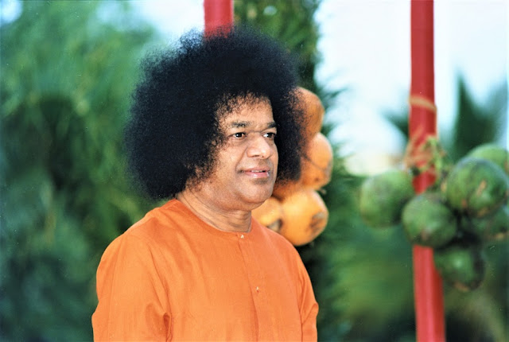
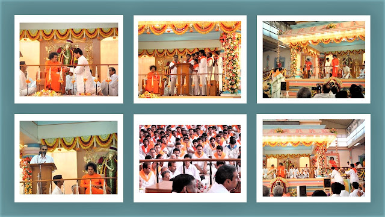
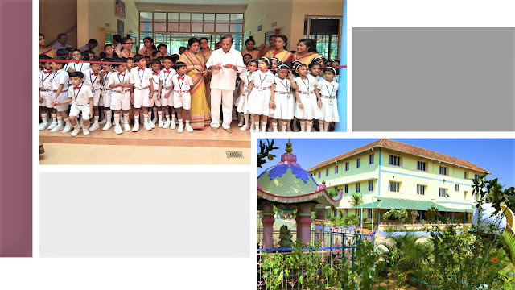
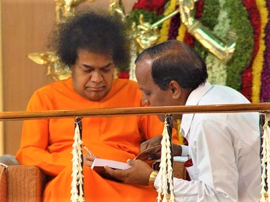

  

Years ago, Bhagavan granted interview to a group of youngsters from Kerala. Bhagavan graciously materialized a ring and put it on the finger of one of the boys. Amazed and overjoyed, he was enjoying the beauty of the Creator’s Creation. “Is ring perfect?” queried the Lord. “Yes, Swami!” the boy answered. To this, Swami said, “Be perfect!” Life’s journey as a humble child of our Beloved Bhagavan is a journey ‘from Sai, with Sai, to Sai’. This journey demands perfection at each and every step, then only can we realize the perfection that is within ourselves!

This journey to perfection demands constant self-audit; the ‘ABC of Life’ that Swami has given us, “Always Be Careful” is very important in this regard. During one of the Vishu elebrations, I got the opportunity to speak in the Divine Presence. In the speech, I highlighted Bhagavan’s assurance, “When you take one step, I take a hundred.” In the Divine Discourse that followed, Bhagavan said, “What Mukundan said is correct. When you take one step, I take a hundred. But, that one step must be in the right direction.” The awareness about this ‘right direction’ must be the light that guides our life’s journey.

Another important aspect of this journey is: be positive always. The second Sadhana Camp of the Sai Youth of Kerala was in progress at Brindavan. On 11th of April 2004, a drama was to be staged by the Sai Youth in the Sai Krishan Kalyanamandapam. At 4.45 pm, we went inside Trayee to report to Bhagavan that everything was ready. But Bhagavan gave us the opportunity to sit near him and talked to us on the theme of the drama. When the discussion came to the point of positivism, Bhagavan asked, “Where does this positivism come from?” Bhagavan was evidently not satisfied with the various answers that we gave; He went on asking the question over and over again. All that we could do was to pray for the Divine Answer on this vital point. Finally, Swami declared, “Positivism need not come from outside; it is inside only. Our duty is to develop it.”
  

Kerala Sai Youth Sadhana Camps at Brindavan

Bhagavan’s Love knows no limits. On one of the days of the Sadhana Camp for the Sai Youth of Kerala in 2005, two youngsters were selected to speak in the Divine Presence, as instructed by Bhagavan. When Swami came to the verandah of the Sai Kulwant Hall, the boys were about to get up to come to Swami. I signaled to them to sit down and conveyed to them that they could come to Swami after Swami occupied the chair. But Swami intervened and told me, “No… They are coming from distant places… Let them come to Me…”

It was on the first day of the Sadhana Camp for Sai Youth in 2003. All the Sai Youth had assembled at the Sai Ramesh Hall, when Swami came for Darshan. I prayed to Bhagavan to inaugurate the Camp, to which Swami asked, “At what time?” “Swami… 8.30…” I replied. “Why so early?” asked Swami, “The boys and girls have just come. They may not have had their breakfast.” It was another instance that revealed how much Swami cares for each and every one of us.

Bhagavan has categorically remarked that His love for us is to the level of seeing Himself in every one of us. Let us see Swami in all, so that our love is pure, selfless and perfect. In this divine journey, it is best to realize that we are nothing and He is Everything. It is He who plans; it is He who does.

In 2004, a school named ‘Sri Sai Vidya Vihar’ was opened in Aluva. The response from the public was tremendous and applications piled up in our office. It became necessary that we purchased a new plot and constructed a bigger building. Banks came forward to offer help. Everything was set to take a financial loan from a bank. Suddenly a devotee came to our office and said, “Why take a loan? This is Swami’s school… I shall contribute the cost of the entire project.”
  

Sri Sathya Sai Vidya Vihar, Aluva, Kerala

We are amazed at the amount of confidence the society has in Swami and His Principles. When we announced the opening of the Sai School, many parents withdrew their children from prestigious schools (despite the heavy donations they had paid to them) and enrolled them in our school. To one of the Muslim parents who had come for admission, we made it clear that we would teach the children Bal Vikas lessons, Veda and Yoga, he happily responded, “Why not? These are part of our culture, let my child also learn them…” After one of the sessions of ‘Sai Parenting’ that was held in the school, a mother approached us and said, “I am terribly upset after today’s session; to this day, I have not been a good mother.”

It is a matter of great joy seeing how the society of Kerala is adhering to Sai ideals. ‘Sai Parenting’ has become the guiding principle of families all over the state. When our young ‘Sai Soldiers’ - the team formed to take Swami’s message to newer and newer areas – visited new areas, they observed that Swami was not at all new there. Wherever they went, they were greeted by Bhagavan’s photographs. Now Swami’s Message is reaching every nook and corner of Kerala.

Bhagavan’s Infinite Love has transformed the Sai Youth of the state. The three Sadhana Camps in the Divine Presence were unique and have provided golden opportunities for them. Now they are fully involved in the Grama Seva Project. We have also been arranging Summer Camps for the Bal Vikas children all over the state for the past three years. Going through the responses of the children, we understand that much more than the sessions of the camp, what touched and transformed them was the love and care the Sai brothers and sisters shared with them. They are motivated to involve themselves in the Sai activities.

Now we have ‘Deenajanodharana Projects’ in all the fourteen districts of the state for rehabilitating destitutes - old and young. One of those who joined one such projects was a boy who had discontinued his studies. We enrolled him in the school and encouraged him to study. He has passed this year’s Std. X Public Examination with 68% marks. These centers convey Swami’s message of Love and Seva to the society. When we commenced this project in one district, the local people, belonging to all religions approached us and asked as to what they could do for the project. Thus Sai Seva transforms not only us, but the society also. Really, we are becoming the “role models” for the society to gauge the Glory of Sai. Once Swami asked a devotee as to what he wanted. He promptly replied, “Swami…. I want to merge in you…” “How is that possible?” Swami asked, “You are very fat… I am very small…” The statement that followed was very revealing, “It you want to merge with Me, become like Me…” Let us observe our Lord; let us emulate Him. Let us try to become like Him, so that we become one with Him.

It was during the Onam of 2002. Bhagavan called me inside the interview room to ask about that year’s Onam Programme. When I took out my glasses to read, Bhagavan smilingly remarked, “See… You are only fifty… I don’t need any glasses… One has to use one’s energies properly.” What a great lesson! We should always be aware as to how we can match His Sankalpa.
  

Prof. Mukundan with Sri Sathya Sai

This narrative will not be complete without sharing with you the Infinite Grace that Swami is showering upon my family and me. During one of the interviews, Swami said, “I am above you, below you, around you and in you… I shall always protect you…” Every split second of our lives has proved this to be Absolute Truth. When we are fully engaged in Sai Seva, Swami will take care of everything - not only the major things of our lives, but also the minutest ones. Once, my elder son, who was then a student at Prasanthi Nilayam, developed distressing headache. He was examined at the Superspecialty Hospital; nothing abnormal was found. The Warden asked me to take him to the NIMHANS, for a second opinion. I took him to Brindavan as Swami was there at that time, to take His blessings and permission. There, Swami told the Warden, “The boy has no problem, but for the satisfaction of the father, let him take him to the NIMHANS.”

As I entered the doctor’s room at the NIIMHANS, he greeted me with a smile as if he knew me. He appeared to be from Kerala; when I told him that I was a Professor at the U.C. College, he was very happy. He was an old student of my college! And it is needless to say that the doctor, after examining my son, said that he had no problem of any sort! A few years back, we were about to leave for Puttaparthi, my younger son, who was then studying in the eighth standard, developed pain in the abdomen. The doctor diagnosed acute appendicitis and advised emergency surgery. His right lower abdomen bulged and was extremely painful. We took him to Parthi and Swami graciously granted us interview. After discussing the matters relating to the Sai Organization, I told Swami that my son was having appendicitis. “What appendicitis…” Swami asked, “No… No… Just Gas…” Within hours, all the pain and bulge disappeared.

The rehearsal for the drama, ‘Bhakta Hanuman’, to be presented in the Divine Presence was on. One night, Swami came in my wife’s dream and told her that the boy who was enacting the role of Hanuman was not holding the mace in the way it should be. True, Swami takes care of even the minutest aspects of our life. Gratitude to our Beloved Bhagavan cannot be expressed fully. It is not to be explained with words, but to be expressed by plunging ourselves into Swami’s Divine Mission. What greater opportunity can we have than to be part of His Story!

Source: Sai Sparshan (2005)