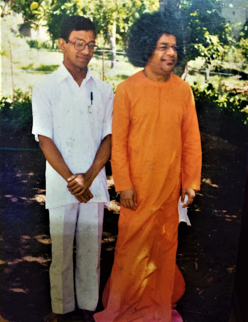
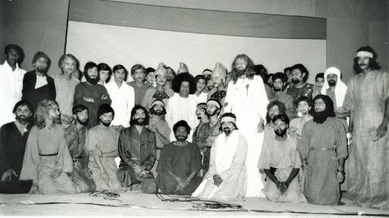
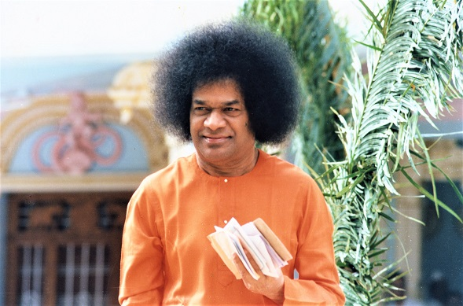
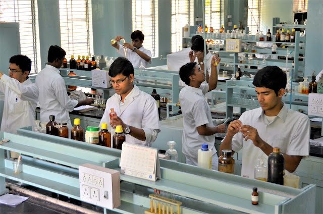
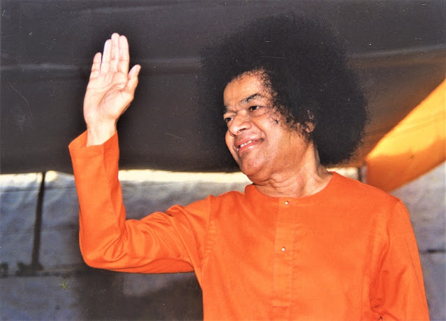

  

Dr. Ravikumar with Sri Sathya Sai

“.... and when we showed the cast to Swami, He said, ‘Ask Ravi to act the role of the blind beggar boy.’ How lucky you are to be remembered by Swami even in your absence! “It was my senior describing to me the events of the past few days. I had come to Parthi from Anantapur to spend my weekend, as was my wont. I was doing my Masters in Chemistry at the PG centre at Anantapur, and the alumni of the Brindavan Sri Sathya Sai College had decided to stage a play depicting the life of Jesus Christ entitled ‘The Kingdom of Heaven’.

During Darshan the next day, Swami told me that he had selected me in the role of the ‘blind boy’ for the drama. He asked us to go to Poornachandra auditorium and rehearse with Christopher St. John, an actor from Hollywood, who was Swami’s devotee. “I will give Darshan to devotees and come there,” He said. My scene was being rehearsed. Jesus asks the blind beggar who prays that sight be bestowed on him, “Boy, do you have the faith that I have the power to do so?” “Yes Lord, I have faith in You.” Jesus rubs on the boy’s eyes and bestows eyesight. Just at that moment, Swami entered the stage. He smiled at us and remarked, “Sai Baba came and Ravi got back his eyesight.”
  

The Drama on Jesus Christ presented by Students and directed by Sri Sathya Sai

The next day, again we went for practice. Even as we were practising, we heard applause outside. Bhagavan was giving Darshan to devotees. We continued with our rehearsal. Again, at exactly the same juncture, Swami arrived and remarked, “Sai Baba came and Ravi got back his eyesight.” After the scene ended, I went and sat near Swami. Swami asked me, “Did you hear people clapping during Darshan? Do you know why? I gave eyesight to an 18-year-old girl who had been born blind. I gave her eyesight just as Jesus gives it to you in the drama. I shall give you also.” I laughed and took Swami’s remark rather casually. This was towards the end of November 1980. I completed my M.Sc. and Bhagavan blessed me with the wonderful chance to join as a lecturer in Brindavan College in 1981. In 1982, He asked me to move over to Prasanthi Nilayam campus where I could continue to teach and also do my research side by side. 

It was July 1985. I had enrolled for Ph.D. and was doing my experimental  work. One afternoon when I was in the lab, the lunch gong sounded. A fellow researcher asked, “Are you coming for lunch?” I said, “Not immediately. I’ll just finish this experiment that I am doing.” I was trying to detect steroids by thin layer chromatography. It was necessary to prepare the Leibermann Buchard spray reagent for this purpose. To prepare this reagent, one has to mix acetic anhydride with concentrated sulphuric acid. As I was doing this, there was a sudden explosion and the next thing I knew, the chemicals had splashed into both my eyes. I shouted ‘Sai Ram’. Hearing this, a few students who had just left the lab, came back running. They asked me what had happened. I could only tell them to take me to the nearest tap. The burning sensation was terrible. The nearest tap was dry, and so were the ones in the vicinity. (I found out later that the water line had been closed as some plumbing work was in progress for the new library building coming up along side.) By the time we found a tap that yielded water, the anhydride-sulphuric acid mixture must have been in the eye for 1½ to 2 minutes. We washed the eye repeatedly. I noted with rising panic that I could not see anything. “Let’s quickly go to the doctor”, said my colleague. There was a general hospital nearby. The route of course, was much longer than it is today. One had to go up the University road and turn left. 

As we went in, the nurse who was there said, “Oh! What a time to come! Our (only!) eye doctor, Dr.Wansa (from Sri Lanka), has gone to get her visa extended.” My heart sank as the nurse examined my eyes and tut-tutted, “I suggest you go to Bangalore”.

It was afternoon Darshan. I had to be led by the hand, as I could not see. Everything was so silent and then it was that the boy next to me whispered, “Swami has come out for Darshan (there was no Darshan music those days). He has turned to the left.... the ladies side...He is near the Dashavataram gate...gents side...East Prasanthi...He is now approaching us....”
  

I could hear the rustle of silk as the Lord passed by me. I thought, ‘Oh! How unlucky I am to be unable to see the Beloved Face...’ I heard Swami’s loving, soothing voice, “Take this prasadam for three days-three times a day. Everything will be fine. I shall protect you. Start today.” He placed three packets of Vibhuti prasadam in my palm. It was the third night after the accident.... I had consumed the last ‘dose’ of vibhuti. As the night prayer ended, I was plunged in thought. I could not control my tears as I recalled all my hopes and aspirations. Having been brought up by Swami as I had lost my mother when I was 4½ years old, I always looked forward to the day when I could finish my studies and in some little way be of service to Swami, and here I was, blind, having to depend on others for the rest of my life. I was depressed and cried myself to sleep.

It was the next morning. There was a knock on the door. “Please come in” I said, and turned to see that one of my student brothers had brought coffee. “Oh you have brought coffee for me” I said. The boy exclaimed, “Sir, can you see!” It was then that the magnitude of what had happened struck me. I was able to see everything clearly and was speechless for sometime. “Yes I can see very, very clearly” I said, overwhelmed.

During the morning Darshan, Swami came straight to me and asked, “How are your eyes?” I had no words to reply. My eyes took over and answered in the language of tears that washed His feet. As I looked up through the film of tears, Swami said, “Go to Bangalore, get yourself a pair of spectacles. Wear them always in the lab. Be careful next time.” A shudder ran through my spine. The last couple of words scared me. ‘Oh God! Would there be a next time?’ Swami’s words would always come true, I knew. But Swami’s kind smile reassured me. I got myself a pair of spectacles and diligently wore them.
  

One of the Chemistry Labs at the Prasanthi Nilayam Campus

Four years later, one morning, the spectacles slipped and fell from my hands and broke. The experiment on hand was of great importance. If I discontinued it for a day or two, the work of a couple of months would go waste. So, I decided that I’d continue to work but, very carefully. During the course of the morning, I had prepared some hot chromic acid (the dark hot viscous liquid emitting fumes would remind one of halahala poison!). I had poured it in a sintered funnel and to finish the work quickly, connected it to a vacuum aspirator - a new one which had just arrived from Japan. Nothing happened for a few minutes or so it seemed. As I went to have a close look, the flask imploded and tipped 30 ml of hot chromic acid into my eyes. “Sai Ram”, I shouted. As the acid streamed down my face and fell on my shirt, the cloth was being eaten up. I was taken to the tap, and much water was liberally splashed on my eyes and face. Even after 45 minutes of washing, the burning sensation was unbearable.

This time the eye doctor was available when we went to the hospital. She removed the handkerchief that was tied around the eyes and examined. She then called the person who had accompanied me, to the next room, discussed something with him; then returned and carefully dressed my ‘eye’. I asked the person who was holding my hands and leading me, “What did the doctor say?” He said, “She said everything was fine.” I knew that this was not true. I understood that this way I could not prise the facts from him. “If Swami asks me what the doctor said, I would have to give Him the correct picture, don’t you think...” I ventured. That did the trick. He said, “The doctor after examining said, ‘There is very severe damage to the eye. I can’t do anything. Swami alone can help”. So that was it. As I sat in the Darshan line with my bandaged eye, many thoughts raced through my mind. ‘Had not Swami warned me so explicitly? Why? Oh, why did I disobey His instructions? Would He be angry with me? Am I, after all, destined to be blind? Did Swami only postpone the inevitable?’ There was a hush. I knew Swami had come out to give Darshan. I heard Swami’s sweet voice, “Emi ayindi, Ravi?” (What happened, Ravi?) I quickly tried to get up. Softly patting me on my cheeks, He continued, “I told you, to be careful next time, didn’t I? You are careless, careless...Hold out your hand. Eat this Vibhuti. Swami will always protect you. Everything will be fine.” I ate the Vibhuti (which Swami had materialised) with relish and relief. From Swami’s own lips, I had heard ‘Everything will be fine.’ And, indeed, Swami’s words would always be true, I knew.
  

The next day, I went to the doctor to have the dressing changed. She removed the bandage and said, “Sai Ram! What a miracle! Your eyes are absolutely fine.” Everything indeed was fine. I could see everything clearly. It is 20 years to date... I live each day grateful to Sai Ma for the boon of eyesight granted to me. Sai is the Sun around whom my life revolves... Even as I was contemplating on writing this article, Swami appeared in my dream and said, “Give the article the title ‘Chaksho Suryo Ajayata’”(It is from the Supreme Being’s Eye that the Sun was born.) Swami elaborated on the title. ‘Chakshu, means ‘eye’; ‘Surya’ means ‘Ravi’; ‘Ajayata’ means ‘was born’. Chaksho Suryo Ajayata - this Vedic declaration will forever remind me that from the Supreme Being Sai was born the sunlight of my eyes.

Source: Sai Sparshan (2005)