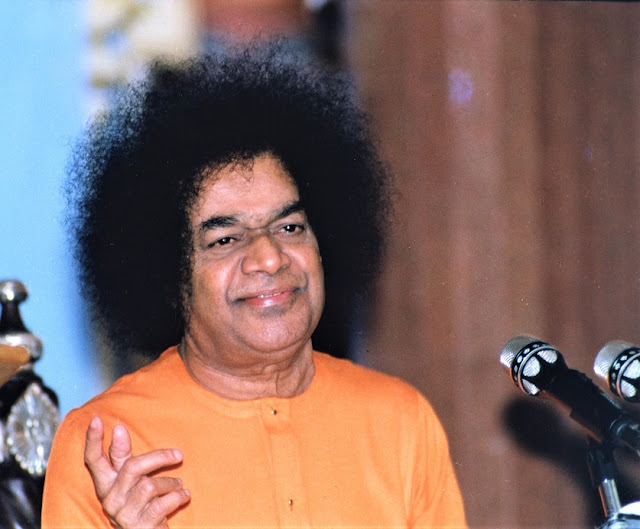
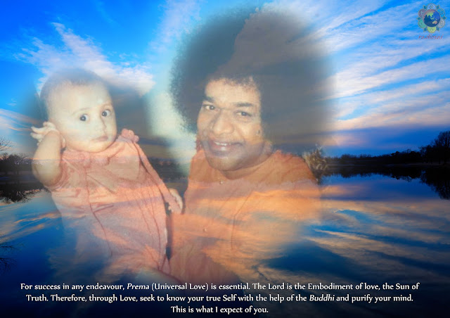
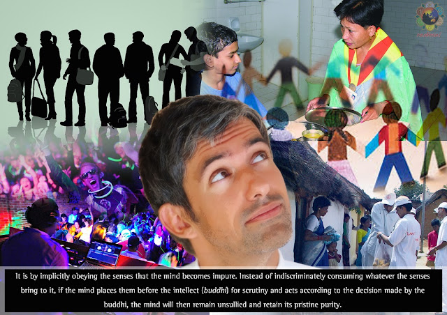

  

Every man has his origin in Truth. He is sustained by Truth. And he merges in Truth. He is the embodiment of Truth. When every individual recognizes this truth, the whole world will be permeated by Truth. What man should seek today is not pleasure. Nor is his goal sorrow. Man should bring under his control the source of pleasure and pain. More than pleasure, it is pain that awakens the wisdom in man. If you study the lives of great men, you find that it is out of trouble and pain that they derived wisdom. Without sorrow there can be no wisdom. It is pain that teaches many wise lessons to man.

Not realizing this profound truth, man pursues pleasure endlessly. No doubt man needs to be happy. But how is happiness to be achieved? It is only when sorrow is overcome that man realizes happiness. Hence everyone should welcome sorrow in the same spirit in which he greets happiness. Wherefrom does pleasure come? When pain is got rid of, pleasure is secured. 

Treat pleasure and pain alike as Divine Gifts 

In our country today the young boys and girls are the inheritors of the prosperity or poverty of the nation. The future progress of the nation depends on them. Hence, these boys and girls are the true wealth of the nation. It has to be realized that man is the architect of his own pleasure and pain. Hence he should face with equanimity whatever happens to him – good or evil.

God is described as Siddhi Swaroopa (the embodiment of wish fulfillment). He is also described as Amogha (One without a limit or measure). This means that the power of the Divine is infinite. He is also known as Aprameya (the immeasurable). Hence, everyone should treat whatever happens to him as a gift from God. Pleasure and pain should be treated alike as Divine gifts. There is a unique joy in this process. 

In daily life we tend to treat defeat, loss or grief as calamities. But, nothing occurs in the world without a cause. Hunger is the cause for eating. Thirst is the cause for drinking.  Difficulties are the cause of sorrow. If man is to enjoy enduring happiness, he must discover the source of such happiness. That source is love (prema). There is nothing greater than love in this world. Everything has a price. The price to be paid for enduring happiness is Divine Love. Without Love, no object can give you real happiness. Hence, the primary wealth for man is Love. Everyone should seek to acquire this wealth. With this wealth anyone can enjoy enduring bliss.

Pain divinizes the pleasure that follows it

We witness in the world all kinds of pains and sorrows. But none of these is permanent. Every term of pain is followed by pleasure. The experience of pleasure is refined and enhanced by the earlier experience of pain. Like the refinement of gold by melting in a crucible, pain divinises the pleasure that follows it.

The New Year or a new month does not bring with it any new joy or sorrow. Every moment is new. Every second is new, because it heralds the march of time. A year is in fact a succession of seconds turning into minutes, days and months. It is only when every moment is cherished as new, will the new year become new. The sacred way in which every moment is spent will determine the fruitfulness of the year. If you wish to lead a sacred life and have sacred experiences, you must engage yourself in sacred actions. The good and evil in the world can be changed only by the change in men’s actions. Transformation of society must start with transformation of individuals.

This morning the students recited a Vedic prayer about students living together in amity and acting in unison. But they did not mention the crucial passage in the prayer which declares: Let us live in harmony free from conflict” The Vedic hymn stresses that unity can come only when people live together without discord. Hence everyone should give no room for conflict or unrest but lead a life of harmony and love with others.

Love is the dispeller of the darkness of ignorance
  

God is ever love incarnate. His love permeates the world. The universe is termed Visvam because of the Lord’s presence in the entire cosmos. One of the names of the Lord is Vishnu. Etymologically the word refers to one who is present throughout the universe. God is the cause and the cosmos is the effect. The Lord is also known as Atma, which means light or effulgence.

The Lord is the dispeller of the darkness of ignorance. Every word used in the ancient scriptures has profound inner meaning. This profundity is characteristic of the Bharatiya spiritual heritage. Very few are interested in exploring these profundities. Most people confine themselves to ritualistic worship for a brief time every day. They do not even attempt to know what for they are performing these rituals. There is no meaning in performing these rituals without understanding the purpose and goal of life. The ultimate purpose of all spiritual exercises is to realize the Love Principle (Love of the Divine). To foster love is the purpose of all spiritual endeavor. In no circumstance should love be given up or ignored. Where there is love, there can be no hatred, grief or want. 

Time is passing. You are all growing in years. But there is little change in your attitudes. Purity in thought results in purity in knowledge and wisdom. Self-Realization can come only through spiritual wisdom (Jnana). Many in the world acquire wealth, fame and position. But what have they achieved in terms of the goal of life? Their failure is due to lack of understanding of the unity that underlies the apparent diversity. It is a mark of spiritual goodness to recognize the divine in everyone. Prahlada declared that you can find God wherever you seek Him. His father, Hiranyakasipu, was a great person because of his attainments. But he failed to achieve goodness because of his denial of the Divine. A similar difference can be seen between Rama’s goodness and Ravana’s greatness.

The lesson for students today is that they should follow the sacred path of righteousness. They should work for the welfare of society. Students should cultivate three qualities. They should cherish love for all living beings; they should cultivate all good qualities; they should acquire all useful knowledge. Love is the basis for these three qualities. 

Fill your Hearts with Love 

See that your love for God does not fluctuate according to whether your wishes are fulfilled or not. Remember that you reap the fruits of your actions, according to whether they are good or bad. Love of God alone can confer enduring bliss. Eschew bad qualities like hatred and envy. Today marks the beginning of the year 1998. At least from today fill your hearts with Love. Look upon all as God’s children. Sri Krishna has declared that all human beings are sparks of Himself. This means that everyone should lead a godly life.

Everyone should express his love to some persons everyday. Thereby the whole world will be filled with love. Ponder for a moment on the phenomenon you are witnessing here today, with thousands gathered from all parts of the world. What is the reason? You are seeking to find something here that is lacking in your native land. What is that? It is Divine Love. You are missing it in your place. You have not found it in yourself. Hence you have come here, like a sick man going to a hospital. Now that you have come here, take back with you Divine Love. Fill your hearts with that Love.

Carry it with you wherever you go like a sick man who carries his medicines with him. Let Divine Love guide you like the mariner’s compass points ever toward the Divine. Dedicate all your thoughts and actions to the Divine. Thereby you will be divinising your entire life. It is by leading such a godly life that our ancients left a glorious heritage. Boys and girls today should fill their minds and hearts with such sacred ideals and transform the entire society into a loving community. 

Sanctify all actions by dedicating them to God

Students! Remember that you are in a ‘golden age’ in your lives. Do not waste it. Do your duty. Love and revere your parents. Serve society. Adhere to the good qualities associated with right education. Be happy and make others happy. From this new year onwards, when students cultivate humility, reverence for elders and love toward all, I shall feel very happy.

At a meeting of the Central Trust yesterday, I told the members that I had no interest in property. Do not involve me in any connection with these properties. I do not wish to have any connection with money or property. My only concern is with my devotees. Telling them all this, I signed the papers.

You are my property. When I have this boundless property, why should I have any interest in material assets? Students are my property. Nothing can give me greater pleasure than what I get from seeing the students lead ideal lives. That is the return I expect from you. No fee of any kind is received from you for your education. But I want you to pay one special fee - that is love. When you offer that fee, you will be offering everything, as it were.

Lakshmana surrendered to Rama totally, declaring that he was offering his family and everything he possessed to Rama. Everyone should follow Lakshmana’s example. He revered his elder brother’s wife as his mother. 
  

The eyes should see only what is good. The hands should be engaged in good actions. The ears should hear no evil and listen only to what is good. Talk no evil. Talk only what is good. Think no evil. Think what is good. Do no evil. Do what is good. This is the way to God. The eyes should see only sacred objects. The whole world will be transformed when your vision becomes holy. 

This is New Year Day according to the Gregorian calendar. We have other New Year days according to the practice in different parts of the country. There is no need to bother about the year as such. Devote every moment to actions that will please God. Develop love for God, which will confer every blessing on you. This is exemplified by the life of Harishchandra. He sacrificed everything in the cause of truth. And ultimately he got back everything by the grace of God. On this New Year Day I wish you all every happiness and prosperity. The ancients used to bless those who come to them with long life of 100 years and good health. They wished the people long life so that they may lead worthy lives. Lead a long life, happy life, peaceful life, loving life and divine life. Redeem your lives by practicing Divine Love.

Source: Divine Discourse on 1 January 1998 at Sai Kulwant Hall, Prasanthi Nilayam