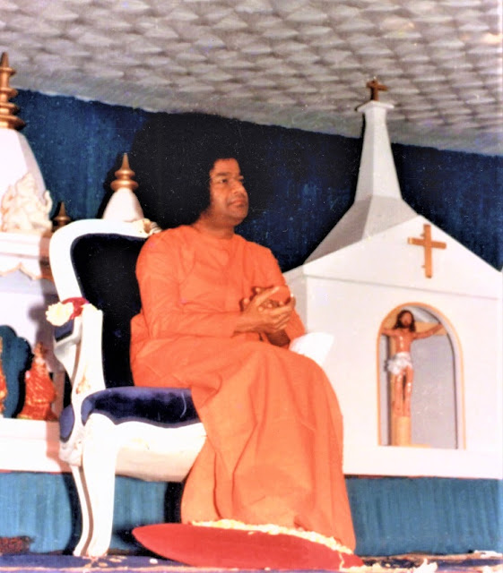

Christmas was celebrated at Prashanti Nilayam on this day. The Christmas Eve was celebrated by the overseas devotees in the Divine Presence at the Round building in Prashanti Nilayam. On 25th morning, Swami gave Darshan through the the silver door from the Mandir balcony. At Poornachandra Auditorium the same evening, Swami permitted the Alumni Association of the Anantapur Campus, ‘Kingdom of Mother Sai’, to celebrate their annual day on 25th December every year. Then Bhagavan delivered His Christmas Discourse followed by a cultural programme by the overseas children. Bhagavan posed for photographs with the children after the show and accepted Mangala Arati. 
  

In His Christmas Discourse, Swami said:

“Love binds one person to another. Love attaches one thing to another. Without Love the Universe is naught. The highest Love makes us aware of the Lord in everyone. The Lord is equally present in all. Life is Love; Love is Life. Without God, deprived of God, nothing and nobody can exist. We live on and through the Divine Will. It is His will that operates as Love, in each of us. It is He who prompts the prayer, "Let all the worlds be happy." For, He makes us aware that the God we adore, the God we love, the God we live by, is in every other being as Love. Thus, Love expands and encompasses all creation.

Looking a little closer, we discover that life itself is Love. They are not two but one. Love is the very nature of life, as burning is the nature of fire, or wetness of water, or sweetness of sugar. We tend a plant only when the leaves are green; when they become dry and the plant becomes a life-less stick, we stop loving it. Love lasts as long as life exists. The mother is loved as long as there is life in her; when life departs, we bury her without the least compunction. Love is bound with life. In fact, Love is Life. The person with no Love to share is as bad as dead. This is the reason why love expands in an ever-widening circle.

Love is the fruit of life. The fruit has three components' the skin, the juicy kernel and the seed. To experience the fruit, we have first to remove the skin. The skin represents egoism, the 'I' feeling, the excluding, limiting, individualising principle. The seed represents 'selfishness', the 'mine' feeling, the possessive, the greedy, desireful principle. This too has to be discarded. What remains is the sweet juice, the rasa, which the Upanishads describe as Divine, the Love Supreme. Parama Prema is Jyothi, Amrutam, Brahma: "Aapo Jyoteeraso Amrutam Brahma." Everyone has the right to partake of this nectarine prema and to share it with others. No one is excluded on the basis of race, caste, creed or place of origin. The only condition is: “Have the skin and the seed been removed?"

Give Love to God and be liberated from worry

When the Love Principle is known and practised, man will be free from anxiety and fear. Imagine your visiting a friend in a city and planning to stay with him for ten days. You have some money with you, and you are afraid to carry it about with you. Now, if you have handed over the purse to your friend for safe-keeping, you can happily go round, to all the places in the city and suburbs you long to visit. You can roam through the busiest market, with no trace of fear. The purse you had is Love; give it all to God. He will liberate you from worry, anxiety and fear.

Through Japa, Dhyana and seva Sadhana, you have to cultivate Love towards God. Take Dhruva, for example. He prayed and practised austerities in order to induce God to grant him the rulership of the Kingdom. But when God appeared as Vishnu before him, he said, "Lord! I do not desire the Kingdom. I want you and you only." Similarly in the preliminary stages, one prays for worldly boons and material gain, but as thoughts get clarified and purified, one desires just one boon from the Lord - He Himself!

For, God is the entity closest to man, dearest to man. Your mother and father might be a little afar but God is right with you, in you. Even if you do not love Him, He will not depart from you or move afar. "Anoraneeyaan" (smaller than the atom) say the Vedas. He becomes "Mahato Maheeyaan," expanding beyond the cosmos and filling all with grace. In every cell. He will be in you. You can earn this awareness through intense Love. 

Good works always provoke the wicked
  

Jesus was compassion (Karuna) come in human form. He spread the spirit of compassion and conferred solace on the distressed and the suffering. Noticing the torture of birds and beasts at the Temple in Jerusalem, he reprimanded the vendors and drove them out of the precincts. He drew upon himself the anger of the priests. Good works always provoke the wicked. But one should not falter or fear when opposition obstructs. The challenge gives joy; it evokes hidden sources of strength; it brings down Grace to reinforce the effort. Pleasure springs during the interval between two pains. One has to struggle with difficulties in order to taste the delight of victory. Jesus was the target for many mighty obstacles and he braved them all. As a result, his name and story and message are shedding splendrous light all over the world now.

Not Jesus only, every Prophet, Messenger of God, Teacher of Truth and Spiritual Leader had to wade through ridicule, neglect and persecution. Though a diamond is cast in a dust bin, its lustre remains; its price will not diminish. Though a sweet pumpkin grows on a thorny fence, its taste remains; its attraction will not diminish. Even if a peacock's egg is hatched in a fowl-roost, its charm remains and its nature does not change.

The Divine, though it moves among all the sundry, can never be affected or deflected. Envious folk heaped insults on Jesus. Even among his disciples, some betrayed him and deserted him. Self-dominated people turn envious at greatness and goodness. But since Prema, the Prema of Jesus, had no trace of self in it, Jesus was unafraid. The loveless are enveloped in fear. Love instills courage and promotes adventure. It delights in daring. If you follow the Master, you can face the devil, fight to the end and finish the game.

Love must bind all believers together
  

Jesus was Love. Sathya Sai too is Love. That explains the gathering of Christians of all sects, which we see here. In Rome today, Catholics gather to celebrate the Advent of Jesus. The Protestants celebrate it by themselves in their churches. The Jews are not welcomed anywhere. But, in the Presence of Sathya Sai, all are equally welcome. The Jews arraigned Jesus and demanded that he should be punished; in this Presence, Jews are adoring that very Jesus. The Prema of Sathya Sai has transformed and transcended those memories. It made them realise that there is only one caste, the caste of Humanity, there is only one religion, the Religion of Love. A few moments ago, AI Drucker spoke to you on Jesus Christ. He got the courage and the wisdom to offer homage to Christ, because of the impact of Swami's Presence. He understands that there is only one God and that God is omnipresent. Names and forms are different naturally; but they are all aspects of the ONE. Love must bind all believers together; not only believers but non-believers too must be loved and served as His images.

Love must be manifested as Service, Seva. Seva must take the form of food for the hungry, solace for the forlorn, consolation for the sick and the suffering. Jesus wore himself out in such Seva. The heart full of compassion is the temple of God. Jesus pleaded for Compassion. Compassion was His Message. He was sorely distressed at the sight of the poor. This day, Jesus is worshipped but His teachings are neglected. Sai is being worshipped but His teachings are neglected. Everywhere, pomp, pageantry, hollow exhibitionism! Lectures, Lectures, Lectures! No activity, no love, no seva. Heroes while lecturing, zeros while putting what is said into practice. Develop Compassion. Live in Love. Be Good; do Good and see Good. This is the way to God.”

Source: Sri Sathya Sai Digvijayam (1926 – 1985)