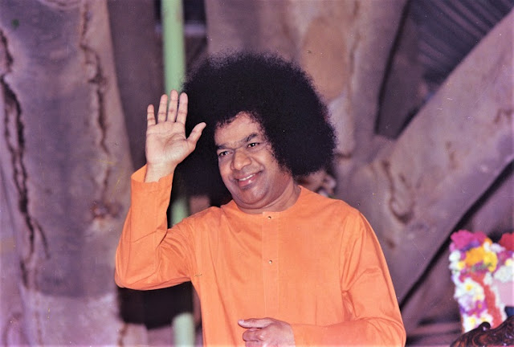
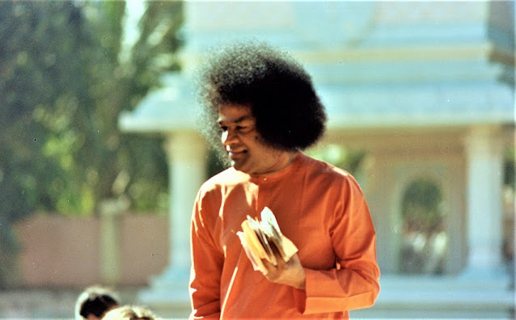
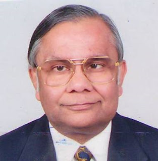

  

Swami always says, “No one can come to me unless I will one to come.” People from all over the world are visiting Him and are blessed with His divine vision, divine touch and divine conversation. Without any invitation, news bulletins, broadcasts, telecasts or publicity, it is only His inscrutable Divine Will that draws His devotees in response to their yearnings and prayers.

In the year 1968, I heard of Swami from the goddess of Gods, that is my mother, who had visited Puttaparthi in that year and had had a conversation with Swami. She narrated her experience to me, which attracted me like a magnet towards Swami. I take this opportunity to express my Pranams to my mother – Matru Devo Bhava – in gratitude. She is no more with us, having left us for her heavenly abode.

In Mahabharata, Kunti always prayed for difficulties in life so that she would think of God. In time of distress, difficulties, depression, worries and anxieties, God responds to our prayers and manifests His Divinity by way of His miracles. The miracles are just visiting cards of our God to step into our lives. Swami’s miracles are expressions of His Divine Grace for his devotees.

I have experienced so many miracles of Swami in life. My youngest daughter Darpan, born on 10th August 1975, was born with a cardiac problem. She had a hole in the heart; medically it is called Ventricular Septal Defect (VSD). She continued to grow as a depressed and sick child. Doctors said that in 50% of such cases, the hole will get covered in the natural process within 10 to 12 years and all the wellknown and eminent Doctors in India advised us to take her to the USA for a surgery. We made all the arrangements for her cardiac surgery by the best pediatric heart surgeon in Honolulu, USA on 2nd July, 1985. However, we also thought of taking Darpan to other eminent doctors in London and the USA who confirmed the opinion for surgical treatment and approved our idea of going to Honolulu. On 1st July 1985, we admitted her to the hospital and on 2nd July morning she was taken for final angiography before being taken to the operation theatre.

Now I experienced a great miracle on this earth. Swami had materialized a ring for me on my birthday on 2nd January 1985, which I wear with great satisfaction. On the same day, Swami had also sent through my brother Kailash a pendant for Darpan. The pendant had Swami’s engraved photograph. The doctor before the angiographic test asked Darpan to take off all clothes and jewellery, which she did but requested the doctor to allow her to continue wearing Swami’s pendant. The doctor said that she could not keep it around her neck, but she could keep it near or below her pillow, which she reluctantly agreed to. During the angiographic test, it was found that the hole in the heart had completely healed.

I repeat, with Swami’s miracle, the hole disappeared and rather than taking her to operation theatre for a major surgical operation, she was discharged and now she is leading a healthy life and with the blessings of Swami, happily married and settled in London. His Divine Lordship blessed the newly married couple on 20th February 2000, at Puttaparthi and materialized a ring for the bridegroom Rajesh. The second miracle of Swami happened in our family in the year 1992. My sister-in-law, Pushpa, developed brain tumour and the doctor advised an immediate surgery in UK or USA. We all came to Whitefield on 5th December 1992, to have the blessings of Swami before leaving for London. Swami, with His divine touch, materialized a Shivalinga for Pushpa and advised her to pour milk or water over it as Abhisheka in the mornings and in the evenings every day and said that she would be totally cured. From the medical symptoms, it was observed by doctors that the tumour was going to be malignant. A major surgical operation was done on Pushpa in London on 12th December 1992, which she went through with a smile. After the surgery, eminent surgeon Dr. Thomas said that the operation was successful but he was afraid that the preliminary pathology reports indicated that the tumour was going to be malignant. However; detailed biopsy report was expected in 3 days’ time. During this period, Swami performed another miracle: the malignant portion became non-malignant. She is now leading a healthy and peaceful life and thanking and praying to Swami for his kind gesture. 

Swami says, “If you walk one step with me, I shall walk ten steps with you!” If we turn initially towards God, start our sadhana, spiritual practice, make progress by taking one step, our merciful Bhagwan walks ten steps with us and grants Grace ten times. We cannot get our photographs unless we turn our face towards the lens of the cameramen. We cannot listen to the radio news unless we tune in and adjust the band accordingly. Then only we get “news”, otherwise nuisance. Similarly, we should take the initial step to earn His grace infinitely.
  

In 1980, I visited Brindavan, Whitefield for darshan. While having darshan, I prayed within myself; “Swami, please enable us to put up one manufacturing plant in the same Whitefield area so that I could have more frequent darshans.” Swami’s miracles are infinite. On my return, I visited one of the factories of Kamini Metals and Alloy in Whitefield and during our discussions, they offered me an extra piece of 5 acres of land which I readily accepted and without any project report or project finance, I set up a tube manufacturing plant named STI Products of India Limited and it has been running profitably since inception. It is Swami’s blessings only that besides a factory at Whitefield, it has been possible to make our dream come true to set up a 100% export oriented granite plant at Tumkur near Bangalore.

Swami says, “Life is a dream, realize it!” It appears as if our whole life sojourn is a dream. We dream of wealth, position, name and fame. But the golden dream in one’s own life should be to see God, talk to God, to be in His company and to receive His blessings. This golden dream is realized when we come to Him, bask in His divine grace and bliss. It is the dream of fulfillment and satisfaction. We decided to lay the foundation stone for the granite factory on 10th August,1992, with the blessings of Swami. It also happened to be the birthday of Darpan, my youngest daughter whom Swami had so miraculously cured of the congenital heart defect. We invited all guests at 4:00 p.m. All of my family reached Puttaparthi that day at 6:00 a.m. to have the blessings of Swami for our maiden diversification venture from steel to granite. Swami did not bless us in the morning but called us at 4:00 p.m., the time of our foundation laying ceremony. This put us in a dilemma and embarrassment. Swami called us at 4:00 p.m. and said “I know the foundation stone is being laid and do not worry, Swami is there.” By His grace, the plant has come out very well. Again Swami blessed us by paying a Divine Visit to bless the granite plant on 2nd April, 1994, which happened to be my second daughter Namrata’s birthday.

Swami has showered abundant love and blessings on us. I and my brother Kailash have been visiting Swami almost every month. We always have His darshan together. Swami in His infinite love calls us Ram and Lakshman. Can one have greater proof of His grace? He sometimes jokingly calls us Larsen and Toubro. Swami can make small things look big and serious things, light.

Swami is the perfect host. I had a personal experience when we travelled to Kodaikanal with Swami. It was a small group of thirty and we all had a wonderful time in Swami’s presence. It was time for food and we all sat down to eat. As the food was being served, Swami said, “Stop, don’t serve rice to Ramesh. He does not like rice.” Well, it is true that I usually don’t eat rice. Swami went in, brought a tiffin box and opened it. There were chapattis in it and Swami served chapatti to me. Who made chapattis, who put them in the tiffin, only Swami knows, but there they were! When out of great amazement I remarked, “Swami, why did you have to take so much trouble for my sake?” Swami smilingly replied, “Ramesh, it is my duty to make you happy.”

My brother Kailash and I, started steel tube manufacturing plant with a meagre capital of Rs. 3 lacs in 1967 and today, with Swami’s blessings and kindness, we have grown into a well-known medium sized group in the country. Industrialists and businessmen are usually concerned with bottom line of their business in terms of Profit and Loss account, which, in short, is called “P&L account”. However, we have been inspired by Swami to continue to make one additional “P&L account”, with “P” standing for Peace and “L” for Love. In the present materialistic world, man’s appetite for money is endless. His desire to get money goes on increasing and thereby peace of mind is disturbed. However, with Swami’s grace, in our group we enjoy to a great degree peace, happiness and harmony which are much more important than any material wealth.
  

About the Author:

Source: Sai Sparshan (2005)