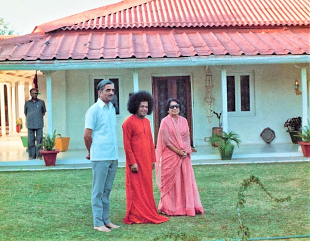
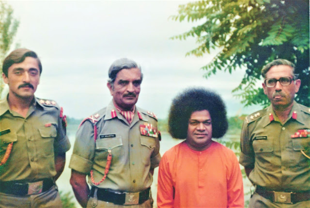
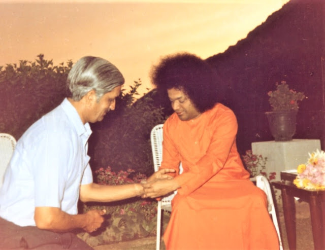

  

Lt. Gen. Malhotra and Smt. Prem Malhotra with Sri Sathya Sai at Srinagar, 1980

Our first contact with Baba came while He was visiting Ooty. The year was April 1974. At that time, I was stationed at Wellington (Nilgiris), Tamil Nadu, commanding the Defence Services Staff College. I got to know about Baba’s visit from my staff officer, Brigadier Dixit who had gone for His darshan the previous day. Till then, we had no knowledge of Swami. After hearing so much about Baba’s miracles, our curiosity was roused and we decided to go for His darshan the next day. We listened to His discourse, which was in Telugu. We returned blessed and with a feeling that He is Divine. We were told that Baba was visiting Wellington the next morning. So, I requested Him to visit our Staff College temple and bless the staff and the students. Baba very kindly acceded to my humble request and visited our temple. His discourse in Telugu was interpreted in English by one of the students. We indeed felt blessed by Swami’s visit to our Institution. 

We were told that Baba was leaving for Bangalore that day but we took a chance and went again for His darshan. We were lucky because Baba had not gone. He called us for the much coveted interview. He was all love and kindness and we were immediately drawn to Him. This started our journey of realizing the Supreme and my Light of Love. He changed the course of my life. I believed in God but I was not particularly a religious man in the conventional way. My contact with Swami turned me Godwards in the true sense. A Professor from Arizona University characterized Baba as “Love walking on two legs”, Walking or sitting, talking or silent, Baba is Love, all the time, to all, in all places. Many people have been transformed by His very Darshan.

My wife and I visited the ashram at Puttaparthi a few months later. The occasion was Shivaratri 1975. The crowds were large but He made it possible for us to have a vantage position in the auditorium. The Shivaratri experience was breath-taking. The next morning I was fortunate to get prasadam from Swami’s divine hands. My joy knew no bounds. My conversation with Baba was a heavenly experience. 

We have been visiting Puttaparthi again and again for three decades. He has showered us with His grace and given so much love. His love is phenomenal, very difficult to understand fully. Baba is a great giver and His love flows to all alike. Our greatest blessing was when Swami listened to our prayers and visited Kashmir. It was a real boon for the people of Kashmir and His devotees in particular. During his stay, he blessed thousands of devotees, irrespective of caste or creed. He appeared to be happy and relaxed during His stay at all the places He visited.
  

Lt.Gen. Malhotra (centre) and his Indian Army colleagues with Sri Sathya Sai in Kashmir

As you enter Srinagar, there is a giant hoarding which reads, ‘If there is a paradise on earth, it is here’. This became a reality when Baba spent almost two glorious weeks there. The time spent in His close proximity was absolutely heavenly and seems like a dream today. He was like a father, mother, friend, guru, all in one. It must have been our great good karmas of past births that brought Bhagavan to our humble home.

Baba has been our tower of strength, whenever we faced a crisis. Our son met with a serious scooter accident in 1978. He was in Mumbai at that time. In the middle of the night, a speeding taxi had hit him. He was grievously hurt but his head was saved despite the fact that he did not have a helmet on. It was Swami’s mercy that saved his life. It took some months but he recovered fully without any permanent disability. We faced another crisis in the early 80’s when our son-in-law came up with a rare kidney ailment. The doctors did not have a ready cure for it. They also felt that even if he recovered, the disease would recur. We were very worried and approached Baba for his help. Swami knew about the ailment and created some medicine to be given to him. After he took the medicine for a few days, the disease started receding and has never recurred. It was Swami’s grace.

My own case is well known. I came up with herpes zoster of the eye. It came up in a severe form and also got aggravated due to my preoccupation with some important work. By the time, I was flown to the Army Hospital in Delhi, my eyes were not opening. It was a real bad case and the doctors were most concerned. Dr. Bhagavantam and Mr. Sohan Lal came to see me in the hospital; Baba had very kindly sent some vibhuti packets through them. Once I was better and able to travel, I came to Swami. He reprimanded me for being negligent and said He had gifted me my eyes. During this period, I was suffering from acute post herpes pains, for which medical science has only pain killers. Baba took away these pains when I spent a week at Puttaparthi under His benign eye. He took me off the pain killers and I came back fully cured. My face had ugly pigmentation marks which the doctors said would never go. In course of time, even those marks disappeared. Such is Swami’s love for His devotees and I felt His benevolence as I recovered. Swami has been our anchor, all these years. We have felt His benign influence in our day to day life, more so in our hour of stress and need.
  

Lt. Gen. S.P Malhotra with Sri Sathya Sai

Sai Baba’s mission does not imply any new cult or religion. Swami wants us to respect all faiths; however, he would like each of us to adhere to his own religion and practise it sincerely. He says there is only ONE GOD and all the religions are various paths leading to Him. He talks about love as the only true religion and wants us to embrace the whole of humanity in our love. We are asked to develop a positive attitude, be good human beings and meet hate with Love. Baba emphasizes on love as a doctrine of life. His saying, ‘Start the day with love, Spend the day with love, and End the day with love - that is the way to God’, sums up His teaching. Love, He says, is a wonderful thing, which works from within a person so that the change is thorough and absolute.

My light of love is the fruit of my life; through this love I visualise Truth. There is nothing above love in this world. All problems can be solved with love, devotion, dedication and determination. My light of love says ‘love more and more people, love them intensely as love is universal and divine and has a deep sense in life and has immense strength’. 

Baba’s miracles are numerous and mindboggling. But his greatest miracle is the transformation, He brings in an individual. Swami’s main programme is of reforming the next generation. He is rendering yeomen service through his educare, sociocare and medicare programmes. Under the educare programme, several educational institutions have been started providing free education to all from primary to doctoral levels. He has started Bal Vikas classes and Education in Human Values as well. Along with academics, moral education is emphasized in all educational institutions. Baba stresses on the role of teachers and the students. He feels, much can be done with the help of ideal teachers and students of high character. Thousands of candles can be lit with a single candle when teachers are ideal gurus guiding the students on right lines. The Medicare programme, is an eye opener to the world of commercial medicine. Through the Super-specialty Hospitals, with free medicines to all, Baba’s Medicare provides medical services, particularly to the rural poor. One of the projects under sociocare has been His Drinking Water Project providing water to 731 villages in Anantapur district. Such a huge project unparalleled in human history is a monumental example of Baba’s benevolence for the betterment of the living conditions of the masses in remote villages.

The list of what Baba has done and is doing for humanity is endless. We are indeed blessed to have Him amongst us. We pray to Swami to keep us in His protecting care. I am most grateful to Bhagavan for giving me the honour and privilege to serve on the Day-to-Day Management Committee of the Sai International Centre for Human Values. I pray fervently to Baba that I come up to His expectations.

About the Author:

Lt. Gen. (Retd.) S P Malhotra, PVSM, served as Commandant, and retired as GOC-in-C, Northern Command; served in Burma and the Far East during the Second World War; was appointed as the first Indian Adjutant at the Indian Military Academy, Dehradun; served in the United Nations Emergency Force at Gaza, Palestine; recipient of Padma Bhushan award, a rare honour for a soldier. He merged at the Lotus Feet in 2010.

Source: Sai Sparshan (2005)