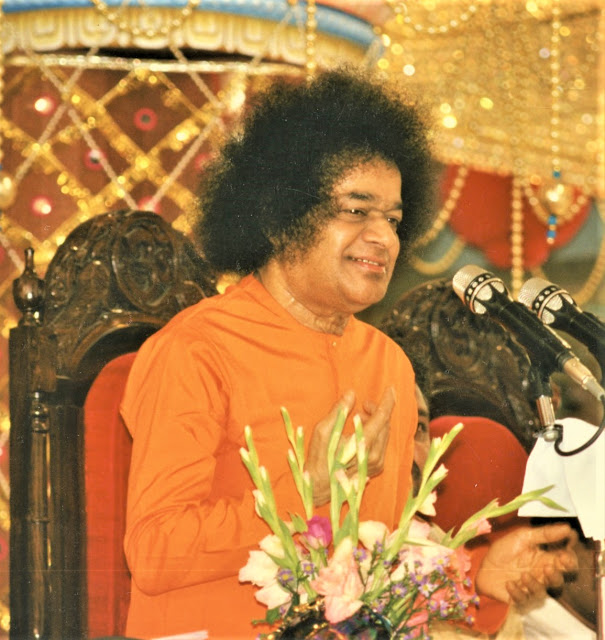
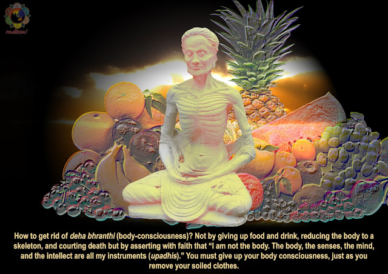

  

The possession of this physical body is by the will of God. This body is completely inert. One might wonder as to how the body continues to grow if it is inert? The car has headlights, which function when there is power supply from the batteries. The horn produces a sound only when power is supplied to it. Thought the headlights and the horn, the nuts and bolts which constitute the engine are also inert, yet they enable the engine to start. All this is because of the power in the car. Inert objects perform their respective functions owing to the power supplied to them. Similar is the situation with this body. For all the organs to function there must be some current. That current is the Atma. This inert body is able to function only because of the Atma. There is a magnet and there are iron filings. The iron filings move in the direction of the magnet. Iron filings are inert, yet they move. It is only because of the magnet. In the same way the Divine Lord, who is dwelling inside the body, performs all the tasks. 

God is the basis of the universe. Whatever cosmetics or perfumes you may use, you cannot change your basic colour, which is given by the Lord. This is the truth. This physical body is given to you to perform different functions and duties. You should never believe that this physical body is permanent and that it never dies. 

There are three defects with this body. The first one is that it seeks ownership of things which are not its own. Next, it treats people as its own, who in reality, don’t even belong to that body. And finally, the body considers untruth as truth. These are the three defects of the body. 

Man believes that he is the physical body. If you are really the physical body then why should you say that it is ‘my’ body. When you say this is ‘my’ body, it implies that you are behind the body. Then how can you say that you are the body. The first defect is that you have already defined yourself as the physical body. In this world we keep on telling that this is ‘my’ body, ‘my’ field, ‘my’ wealth, ‘my’ money, etc. How long will it be yours? We have attachment to such transient things and we keep on claiming that they are ours. Nothing is yours in this world. You are not the body. How can this body belong to you? This is all illusion. You have possessiveness, which emerges from your mind. These are all passing clouds which come and go. Does anyone, before marriage, know who is the husband and who is the wife? So too, does anyone, before birth, know who is the father and who is the son? It is only after the birth that you say he is my son, and only after marriage you can say that she is my wife. These relationships, established during the course of life, are like passing clouds. There is no permanent relationship between these things at all. You go on telling ‘these are my people, my people’. This is the physical delusion of the body. When you came to this earth, you did not have a single piece of cloth. Nothing is yours. We are facing all these problems today only because we think that all these things belong to us. You belong to none of them. 

There is only one truth and that is that this body is not permanent. One person gets married and when his wife comes she addresses him as ‘my dear husband’. The daughter comes and addresses the same person as ‘my dear father’. His mother comes and addresses him as ‘my dear son’. If his son-in-law comes he addresses him as ‘my dear father-in-law’. All this relationships are related to the same physical body. The same body is the son, father, brother, etc. The fact is that there is only one truth and different people talk about it in different ways. Different types of relationships are established with this single body. I am one, but I have multiplied myself in many forms. The unity in everything is one. There exists, in reality, only one thing. That is the hero (God). Entire world is a big zero. When you keep this zero next to one it becomes ten. Another zero makes it hundred. Put one more zero it becomes thousand. How are these zeros getting their value? It is because of the hero that is one. If you remove this one then the value is only zero. Divinity, Divine power and God is the only hero. The delusion of this body, mind and intellect is zero. 

Consider the Body as an Instrument

But at the same time we should discharge our duties. We should never give it up. It is your responsibility to take care of your children. While discharging your duty you should never forget about the ‘Paramatmic’ vision. The worldly life should be enjoyed by keeping this vision at the forefront. As long as you live in this world you should follow the code of the life. Our purpose, while performing all actions, must be only one - to reach God. 

In the world everything undergoes change. How can you believe this mind which undergoes many changes? The physical body depends upon the mind. When any one is born it is called a ‘child’. After ten years we call the same child as ‘boy’. After 30 years you call the same entity as ‘man’. After 75 years, we call the same body as ‘grandfather’. This child, boy, man and grandfather are one and the same entity. These changes are only with reference to the name and the form. These are different types of delusions. This physical body is the basis for all these illusions. It is not proper to firmly believe that this physical body is the permanent one. You have to keep this physical body fit for performing various actions. Until you cross the ocean or the river you should take care of your ships. For whatever period you may be alive you should not allow worldly desires to enter within you. You live in the world and also enjoy the world. But do not get attached to the world. All the diseases come because of attachment. You stay where you are. Consider the body only as an instrument. Discharge your duties. Believe that this body is an important instrument. Consider this body as a vesture. 

Make efforts to cleanse your physical body from all the bad actions. You give your clothes to the Dhobi (washer man), who removes the dirt from it. What is the nature and colour of this cloth? It is white (the white clothes that Swami’s students wear). It is white, but after our use it changes its colour.  When it becomes dirty you send it for a wash. The Dhobi removes the dirt and brings the clothes back to you. But the reality is that the washer man has not given the white color to the clothes. All that he has done is that he has removed the dirt. In the same way, this physical body also resembles some colour. It is natural for this physical body. When you put this body for wrong use, dirt accumulates. But when you chant the Lord’s name and do Japa and Tapas, you remove the dirt. God may be compared to a washer man. He is the one who purifies your heart. You offer your heart to God and He will cleanse it. 

If you want your clothes to be cleaned, you give them to the washerman and not to the barber. Similarly, if you want to purify your heart then offer it to God, not to the world. When you put this body to proper use and for proper action it will purify itself. Consider this body as a cloth worn by you. You are not the body, it is only an instrument. It is ignorance to consider yourself as the body. You can shine with splendour only when you are free from this ignorance. 
  

My Dear Students!

Take this physical body only as an instrument. There are few more things which form the basis of this body. There are some inner sense organs which are different part of this body. Along with all these sense organs there is the mind which controls the body. You also have the intellect which keeps the mind and sense organs under its control. The Ghee (clarified butter) from the Laddu (an Indian sweet) will spoil the shirt and leave a mark on it if the Laddu is kept in the pocket. In the same way even thoughts leave marks. So channelise your thoughts in appropriate directions. Man can only prosper when he understands the inner meaning of his mind, intellect and sense organs. People suffer because they have not understood the meaning of the physical body. We are wasting time in the name of Sadhana (spiritual practice). There is no need for doing any type of Sadhana. Recognise the Truth. That is the best Sadhana. All Sadhana is meant to teach you the Truth. Once you have the vision of Truth where is the need for Sadhana. Fuel is required only as long as the food is cooking. Once the food is cooked there is no need for the fuel. We should understand the secrets related to the body, mind the sense organs and the intellect. It is the five elements which are all pervading. The entire cosmos is filled with these five sense organs. We should understand the Truth properly and conduct ourselves in the light of proper understanding. You should understand that God is the basis of all things. This is God’s will. Students should develop faith in God. Make efforts to offer your hearts to God. 

Source: The Human Body: A Temple Of God, Discourse 10, My Dear Students Volume 4; Divine Discourse delivered on December 10, 1993 at Prasanthi Nilayam