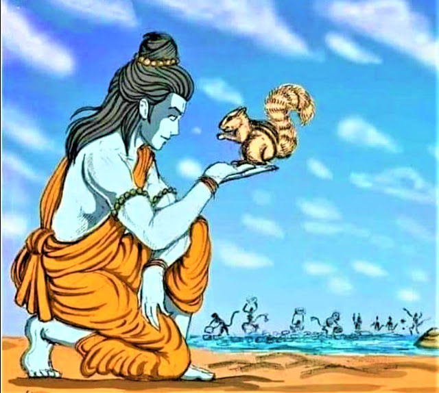

Excitement ran high amongst the vanara ranks. The Lord’s work was at hand. The bridge to Lanka had to be built as soon as possible and they could not afford to waste any time. They threw into the sea whatever they could lay their hands on – tree trunks, rocks, boulders; even hills were uprooted for the purpose. On the shore a tiny squirrel was keenly watching all the action. All of a sudden, this little creature too felt a sudden urge to participate in the Lord’s mission. He was aware that he was too small to be of any use. “I am too little,” he thought to himself. “What will I be capable of doing amongst these gigantic monkeys?” Then, somewhere in his tiny little mind, an idea flashed. He rolled about in the sand, ran down to the bridge, shook off a few grains of sand, ran back to the shore, collected some more sand and deposited it on the bridge. The tiny squirrel repeated this ceaselessly, without any break. Some distance away, Lord Rama was seated in His tent watching the antics of this little squirrel. 
  

Amply pleased by its service, Lord Rama picked it up and lovingly caressed it. As a mark of Lord Rama’s appreciation of this little squirrel, three golden streaks appeared along the squirrel’s spine where the Lord’s fingers had touched it. Even today squirrels bear the sign of God’s appreciation on them in the form of the three stripes running across their back. When God Himself has shown so much of appreciation for a task which is so insignificant, how much of gratitude must we show the Lord for all that He has done for us? He has given us everything bountifully and made our lives peaceful and happy in His Presence.

This is true of Swami’s own students – whom He considers as His own property. To enumerate all that He Has done for us would be an impossible task. He has given us education of the highest standards free of cost, a spiritual foundation too strong to be shaken, and above all this, His physical proximity, which is the envy of gods, and His limitless love, which is unmatched in any way. To be with Him is what the devas and the gandharvas yearn for. We enjoy His presence day and night and drink the nectar of His Love. Sages perform penance for thousands of years to earn His grace, and here He is showering it on us in abundance. What more can we ask for? Bhagavan is like a potter who has shaped us with His own hands into beautiful pots from mere lumps of clay. It is time we offered our heartfelt gratitude to Bhagavan for having given us everything in life. What does our great Lord ask from us in return? The lines of a song drift into my mind – “All I want is your Love, my child, all I want is your faith All I want is your Love in God, no matter what’s your faith So says Baba, Sathya Sai Baba, Sathya Sai Baba, my Lord.”
  

Sri Sathya Sai Institute of Higher Medical Sciences, Puttaparthi

Love is all that He seeks. Is it too much to ask for? The word ‘Love’ reminds me of a touching incident, which according to me is the best example of gratitude. When preparations were being made to commence the construction of Sri Sathya Sai Institute of Higher Medical Sciences in Prasanthi Nilayam, Bhagavan was looking into every detail connected with the construction. During one darshan session, while moving amongst the students He accepted a letter from a little boy. Clutching the letter in His hand, he went inside the interview room accompanied by some doctors. He suddenly came out and beckoned that small boy. He asked him, “Should I read out aloud what you have written to me in this letter so that everyone can hear?” The little boy was hesitant for a while and then he replied, “Whatever You wish Bhagavan.” Bhagavan then read out this boy’s letter for everyone present to hear. The boy recounted in the letter how Bhagavan was providing free education to all His students and was now constructing a big hospital that would provide the most modern health care facilities to every section of the society totally free of cost. This little schoolboy prayed that he too wanted to be a part of Bhagavan’s glorious mission. Yet, being a small boy from a middle class family, he did not know how he could contribute to Bhagavan’s work. He mentioned in the letter that for the last three months he had been trying to save from the meagre amount his parents sent him every month. In order to do this he had avoided giving any clothes to the washerman and had been washing his clothes himself everyday. He had also resisted the temptation of chocolates and other delicacies so as to save some money. In all his innocence, this boy now wanted to offer a hundred rupees to Bhagavan. While he was ashamed that he could offer only such a small amount for this gigantic task, he prayed to Bhagavan to accept this offering saying that he would be the happiest child in the world if this money could be used to buy a small brick for the new hospital. So saying, he had enclosed a hundred rupee note with his letter. 
  

There was a twinkle in Bhagavan’s eyes when this letter was read out. Like a proud mother Bhagavan held the 100 rupee note in His hand and told the little boy, “My dear son, this is not a 100 rupee note for me. This note is worth much, much more than crores for me.” It was not the amount that Bhagavan saw, but the feeling of love and gratitude, which had poured forth from the innocent boy’s heart. The Lord is ‘Bhaava Priya’ and not ‘Baahya Priya.’

We must also make an effort to repay our debt to Bhagavan. The onus is upon us to participate in Bhagavan’s mission and contribute our bit to it. Let our contribution be at least a few grains of sand like that of the small squirrel. Let us begin by pledging that we shall follow every word of Bhagavan and thereby offer our sincere love and gratitude to Him.

Source: Sai Sparshan (2005)